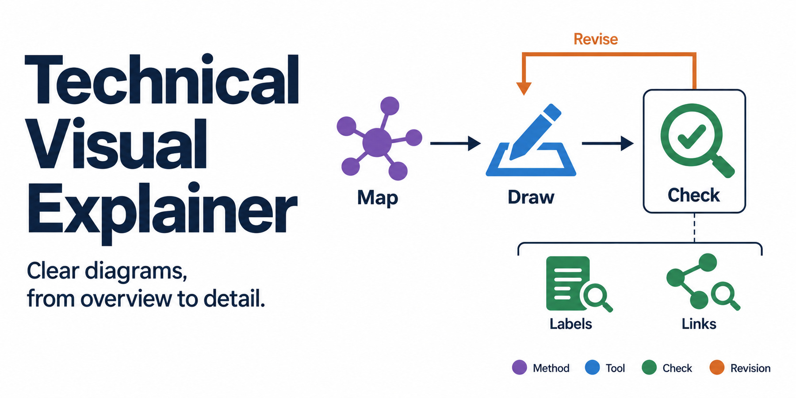
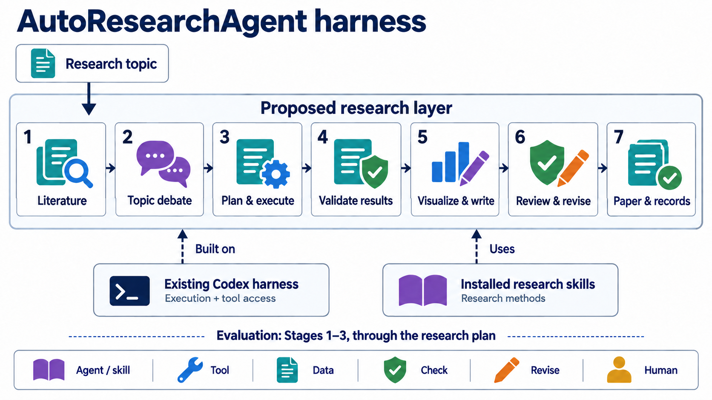
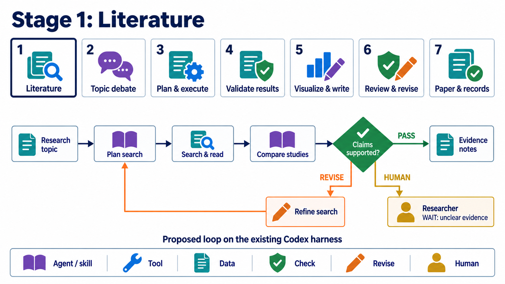

# Technical Visual Explainer

**Give your agent a topic and references. Get a clear diagram, with details that stay connected to the big picture.**

[English](README.md) · [繁體中文](README.zh-TW.md) · [Skill](skills/technical-visual-explainer/SKILL.md) · [Design records](docs/design/brief.md)

[](LICENSE)
[](https://github.com/WenyuChiou/technical-visual-explainer/actions/workflows/check.yml)

A portable agent skill for explaining workflows, architectures, mechanisms and
coupled systems. It guides the agent to establish the relationships first,
choose the right visual form, then inspect the actual image. For presentations,
it can keep one overview visible while successive views expand each part.

The skill supplies instructions. Your agent supplies the reasoning, image
generation and file tools. It is not a standalone drawing application.

## Start with the explanation you need

```text
Use $technical-visual-explainer to explain this system using the attached
references. The audience is CS students. Make a white-background overview
for a README, then two detail views for a talk. Use filled colored icons
with consistent meanings. Keep the overview visible and highlight the
part being explained. Check the images at 900px wide. Ask only about
missing choices that would change the diagram.
```

Supply the topic or source material, the audience, where the image will appear,
and any style reference. You can request a single figure; a progressive series
is useful when the explanation needs more than one level of detail.

## Choose a view that fits the question

| Reader's question | Suitable view |
|---|---|
| What happens next? | Workflow with explicit branches and return paths |
| What is built on what? | Architecture with boundaries and dependencies |
| How does this part work? | Detail view linked to the same overview |
| How do the alternatives differ? | Parallel comparison with a shared basis |
| How does one system affect another? | Mechanism or coupling diagram |

Measured data belongs in a real plot with axes, units and uncertainty where
appropriate. The skill routes those charts to standard plotting tools, not
image generation.

## See the overview become a detail

This development example proposes a research workflow built on the existing
Codex harness. It uses installed research skills for methods. The example's
evaluation stops at a research plan; later stages are future extensions.



The next view retains the stage names, order and colored icon parts. Stage 1
gets a navy focus outline; its literature loop expands below. Green reaches
the accepted output, orange returns to a specific correction, and gold
explicitly waits for a researcher when needed.



These are design and instruction-development examples, not evidence that the
proposed research agent has been implemented or that its results are correct.

## Install

Install **only** the directory
[`skills/technical-visual-explainer/`](skills/technical-visual-explainer/SKILL.md),
including its references. Keep the repository README and cover assets outside
your host's skill loader.

With a Codex skill installer, ask:

```text
Install the skill from
https://github.com/WenyuChiou/technical-visual-explainer/tree/main/skills/technical-visual-explainer
```

Or clone the repository and copy that one directory into your host's skill
directory. In Codex this is normally `$CODEX_HOME/skills/`, or `~/.codex/skills/`
when `CODEX_HOME` is unset. Invoke `$technical-visual-explainer` after it is
loaded. Compare an existing copy before replacing it.

Other agents can read `SKILL.md` and the linked references through their own
skill loader. The optional `agents/openai.yaml` contains Codex UI metadata.
The package does not install image tools, create an API service, or register a
marketplace plugin. Compatibility depends on the host's tools and loader;
end-to-end execution across other hosts has not been tested here.

## What gets checked

- **Relationships:** inputs, work, outputs, boundaries and exact arrow targets;
  correction paths must lead to rework and another check.
- **Actual image:** text, icon colors, arrows, focus, cropping and readability
  at the intended display size. A valid text specification is not image QA.
- **Across views:** names, order, meaningful icon parts and reading positions
  remain recognizable; focus and implementation status are separate.

The optional [graph checker](skills/technical-visual-explainer/scripts/check_graph.py)
audits a small directed JSON specification. It cannot inspect pixels or establish
scientific correctness. Run the package's existing tests with Python 3.12 or later:

```bash
python -m unittest discover -s tests -v
python -m unittest discover -s skills/technical-visual-explainer/evals -p 'test_*.py' -v
```

These tests need only the Python standard library. Loading the skill itself
requires no Python installation. The host's model and tool usage may have costs.

## Tools and limits

The default complete-diagram path uses the host's built-in image generation.
Explicit requests for editable native figures take precedence. If a required
tool is unavailable, the agent must say what remains unfinished instead of
silently changing providers or claiming a finished image.

Generated images can contain incorrect text or connections. Full-image edits
can also alter regions that were supposed to stay fixed. Inspect every selected
image; stable meaning and layout do not mean identical pixels. Audience
understanding and personal style preference require actual feedback.

An optional [HydroCNHS reference](skills/technical-visual-explainer/references/hydrocnhs.md)
helps keep policy decisions separate from physical-model calculations. It is
loaded only for relevant work, and implementation claims still require current
project evidence.

For slides, scripts and talk preparation, pair this skill with
[Research Talk Coach](https://github.com/WenyuChiou/research-talk-coach).
See the [design brief](docs/design/brief.md) and [visual QA record](docs/design/qa.md)
for this repository's covers. They were made with imagegen; no exact image-model
version or human-authored origin is claimed.
