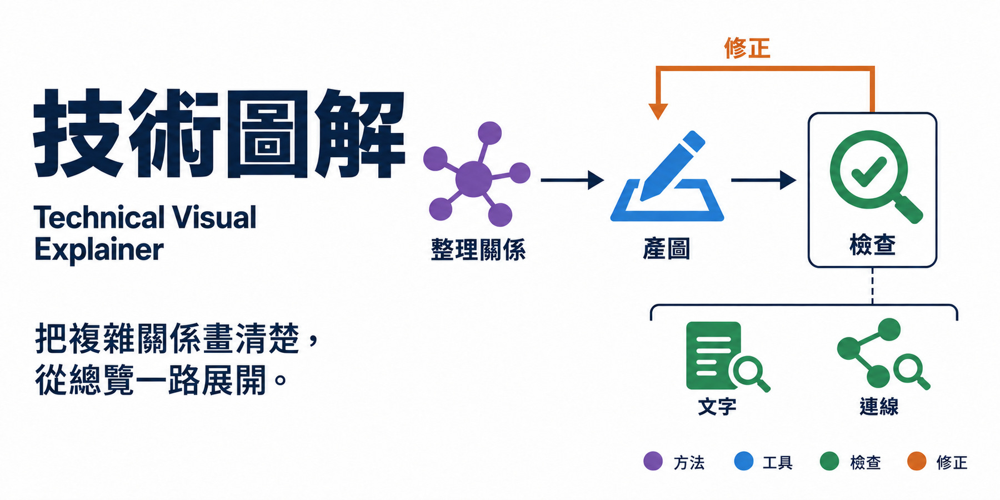

# 技術圖解 · Technical Visual Explainer

**提供主題與參考資料，讓 agent 畫出清楚的圖，並讓細節與整體架構對得起來。**

[English](README.md) · [繁體中文](README.zh-TW.md) · [Skill](skills/technical-visual-explainer/SKILL.md) · [設計紀錄](docs/design/brief.md)

[](LICENSE)
[](https://github.com/WenyuChiou/technical-visual-explainer/actions/workflows/check.yml)

這是一個可攜式 agent skill，用來解釋流程、架構、機制與系統耦合。
它先協助 agent 確認各部分的關係，再選擇合適的圖型，並檢查實際產出的圖。
用於簡報時，可以保留同一張總覽，逐頁展開正在講解的部分。

Skill 提供方法指引，推理、產圖與檔案工具由你的 agent 環境提供。
它本身不是獨立的繪圖軟體。

## 從你要解釋的內容開始

```text
使用 $technical-visual-explainer，根據附件解釋這個系統。
觀眾是 CS 學生。請製作一張白底 README 總圖，再做兩張簡報細節圖。
使用有實色填面的彩色 icon，顏色意義前後一致。
保留整體地圖，亮起目前講解的部分，並以 900px 寬度檢查圖片。
只針對缺少、而且會影響構圖的資訊提問。
```

提供主題或來源、觀眾、圖片用途，以及需要遵循的風格參考。
只需要一張圖也可以；當內容需要不同層次的說明時，再使用漸進式圖組。

## 依問題選圖型

| 讀者想知道什麼 | 適合的圖 |
|---|---|
| 下一步會發生什麼？ | 有明確分支與返回路徑的流程圖 |
| 哪個部分建立在哪個基礎上？ | 區分邊界與依賴關係的架構圖 |
| 這個部分如何運作？ | 與同一總覽連接的細節圖 |
| 不同方案差在哪裡？ | 使用相同比較基礎的平行比較圖 |
| 一個系統如何影響另一個？ | 機制圖或耦合圖 |

實測資料應使用真正的數據圖，保留座標、單位及適用的不確定性資訊。
這類圖會交給標準繪圖工具，不用生成圖代替數據。

## 看總覽如何展開

這個開發案例提出一套建立在既有 Codex harness 上的研究流程，
並使用已安裝的研究 skills 提供方法。本案例驗收到研究計畫，後續階段屬於未來擴充。


下一張保留相同的階段名稱、順序及彩色圖示。Stage 1 加上深藍焦點框，
下方展開它的文獻處理流程。綠色通往通過檢查的輸出，橘色回到具體修正步驟，
需要研究者判斷時，金色分支明確停在等待狀態。


這些圖是設計與 skill 開發示例，不能用來證明提案中的研究 agent 已經實作，
也不能證明它的研究成果正確。

## 安裝

只安裝 [`skills/technical-visual-explainer/`](skills/technical-visual-explainer/SKILL.md)
目錄，並保留其中的參考檔。Repo 的 README 與封面素材不需要放進 skill 載入目錄。

使用 Codex skill installer 時，可以說：

```text
請安裝以下位置的 skill：
https://github.com/WenyuChiou/technical-visual-explainer/tree/main/skills/technical-visual-explainer
```

也可以 clone repo，再把該目錄複製到使用環境的 skill 目錄。
Codex 通常使用 `$CODEX_HOME/skills/`；未設定 `CODEX_HOME` 時使用 `~/.codex/skills/`。
載入後以 `$technical-visual-explainer` 呼叫。若已經有同名版本，先比較內容再替換。

其他 agent 可以透過各自的載入方式讀取 `SKILL.md` 及相連的參考檔。
選用的 `agents/openai.yaml` 是 Codex 的介面資訊。
這個套件不會安裝產圖工具、建立 API 服務或註冊 marketplace plugin。
是否能完整執行取決於使用環境的工具與載入功能；本 repo 尚未完成其他環境的端到端測試。

## 會檢查什麼

- **關係**：輸入、工作、輸出、邊界與箭頭終點；修正後必須回到需要重做的步驟並重新檢查。
- **實際圖片**：文字、圖示顏色、箭頭、焦點、裁切與使用尺寸下的可讀性。
  文字規格正確，不代表圖片正確。
- **前後對應**：名稱、順序、圖示中有意義的部分及讀圖位置保持可辨認；
  目前焦點與實作狀態分開表達。

選用的 [graph checker](skills/technical-visual-explainer/scripts/check_graph.py)
可以檢查簡單的 JSON 有向圖規格，但不能看圖片像素，也不能判定科學內容是否正確。
以 Python 3.12 或以上版本執行現有測試：

```bash
python -m unittest discover -s tests -v
python -m unittest discover -s skills/technical-visual-explainer/evals -p 'test_*.py' -v
```

這些測試只需要 Python 標準函式庫。單純載入 skill 不需要安裝 Python。
使用環境的模型與工具可能產生費用。

## 工具與限制

完整解說圖預設使用環境內建的產圖工具。若你明確要求可編輯的原生圖形，
會以你的要求為準。必要工具不可用時，agent 必須說明尚未完成的部分，
不能悄悄換供應商或宣稱圖片已完成。

生成圖可能出現錯字或錯接的線；局部修改也可能意外影響其他區域。
每張選用的圖都需要實際檢查。意義與版面穩定，不代表像素完全相同。
觀眾理解與個人風格滿意度仍需要實際回饋。

選用的 [HydroCNHS 參考](skills/technical-visual-explainer/references/hydrocnhs.md)
協助區分政策決策與物理模型計算，只在相關工作中讀取。
涉及實作的說法，仍須核對當前專案證據。

如果還需要投影片、逐字稿與講述準備，可以搭配
[Research Talk Coach](https://github.com/WenyuChiou/research-talk-coach)。
本 repo 封面的 [設計邏輯](docs/design/brief.md) 與 [畫面驗收紀錄](docs/design/qa.md)
保留於 repo。封面使用 imagegen 製作；不宣稱特定產圖模型版本或人工手繪來源。
